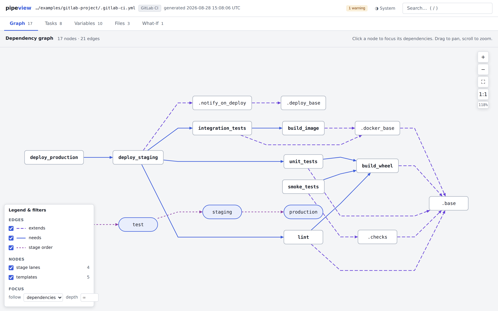

# pipeview

[](https://github.com/FooBarbarian-dev/make-make-diagram/actions/workflows/ci.yml)
[](https://github.com/FooBarbarian-dev/make-make-diagram/releases)
[](LICENSE)

Offline interactive HTML reports for GNU Make and GitLab CI pipelines.

`pipeview` reads build-pipeline definition files and produces self-contained,
fully offline, interactive HTML reports that help people understand how the
pipeline works: what builds what, what tasks can be run, where variables come
from, and how files include each other.

It can also connect to a GitLab instance (`pipeview gitlab`), browse the
projects you can access from a terminal UI, and generate the same reports
straight from what GitLab serves — cross-repository `include:`s resolved
and all.


*The Graph view of a GitLab CI report: the `needs:` DAG, `extends:` template
edges, and a legend that doubles as the view's filters. See the
[user guide](docs/user-guide.md) for a full tour with more screenshots.*

## Quickstart

```bash
git clone https://github.com/FooBarbarian-dev/make-make-diagram.git && cd make-make-diagram
pip install .
pipeview examples/make-project -o examples/out
open examples/out/Makefile.report.html   # xdg-open on Linux, start on Windows
```

The report opens on the **Graph** tab — an interactive dependency DAG showing
build targets, prerequisites, pattern rules, and sub-make recursion. Click a
node to inspect it. Switch tabs to **Tasks** (runnable targets with
descriptions), **Variables** (searchable table with event timelines), or
**Files** (include tree and diagnostics). Everything works from `file://`
with no network.

For the GitLab example:

```bash
pipeview examples/gitlab-project -o examples/out
open examples/out/gitlab-ci.report.html
```

This report shows a `needs:` DAG that differs from stage order, an `extends:`
chain through templates, resolved includes plus a *ghost* one (a reference
that can't be resolved offline, drawn dashed), and a manual production gate.

## Installation

### Standard install

```bash
git clone https://github.com/FooBarbarian-dev/make-make-diagram.git
cd make-make-diagram
pip install .
```

Or use `pipx` for an isolated CLI install:

```bash
pipx install .
```

To update later: `git pull` and re-run the install (`pip install .` or
`pipx upgrade pipeview`). `pipeview --version` shows what you have.

### Development

```bash
pip install -e ".[dev]"
pytest           # run the test suite
ruff check .     # lint
```

### No-install (run from checkout)

The only requirement is Python 3.10+ and PyYAML:

```bash
pip install PyYAML
python -m pipeview examples/make-project -o examples/out
```

### Air-gapped install

On a machine with internet access, build the wheels:

```bash
pip wheel . -w dist/
```

Transfer the `dist/` directory to the target machine, then:

```bash
pip install --no-index --find-links dist/ pipeview
```

After install, report generation performs zero network access, ever — only
the explicit `pipeview gitlab` subcommand talks to a network, and only to
the GitLab host you name. Generated reports are self-contained HTML files
that work from `file://` — no CDN, no remote fonts, no fetches of any kind.

## HTML report views

The generated report is a single self-contained HTML file with four views
(five for GitLab CI). The [user guide](docs/user-guide.md) walks through each
one with screenshots.

1. **Graph** — Interactive dependency DAG with pan/zoom, click-to-inspect,
   focus mode (highlights the reachable subgraph, with direction —
   dependencies / dependents / both — and hop-depth controls), and a legend
   that doubles as the view options: edge-kind filters, node-kind toggles
   (stage lanes, templates, pattern rules, unresolved references), and
   collapsible groups — GitLab child pipelines and recursive sub-makes fold
   into one expandable node each, with their trigger/recursion edge attached.
   Ghost nodes (unresolved references) appear dashed.

2. **Tasks** — Runnable targets/jobs listed with name, description,
   invocation command, and flags. The "what can I run?" page.

3. **Variables** — Searchable table of all variables with event
   timelines showing where each was defined, overridden, or appended, with
   scope and file:line. Recipe text renders `$(VAR)` references as clickable
   links. For GitLab CI, predefined `CI_*`/`GITLAB_*` variables carry curated
   docs — what each is, an example value, and when GitLab sets it — and a
   collapsible reference below the table documents the whole catalog, with
   the names this configuration references sorted first.

4. **Files** — Tree of source files with include/recursion structure,
   per-file status, and all diagnostics.

5. **What-If** *(GitLab CI reports only)* — A pipeline simulator. Pick an
   event (push, push with an open MR, tag, MR update, schedule, manual,
   API/trigger), set the starting state (branch, MR target/draft, changed
   files, project-level variables), and see every candidate pipeline GitLab
   would spawn — side by side, one graph per pipeline, with per-job
   verdicts (runs / manual / delayed / not added / depends) and a
   rule-by-rule trace for each. Duplicate jobs that would run in more than
   one pipeline for the same push are badged and summarized; dotenv
   artifact propagation and `needs:` on jobs missing from the pipeline
   (a real pipeline-creation failure) are called out. `rules:if`
   expressions are compiled at generation time; `rules:exists` is checked
   against the actual repo; anything unknowable (`rules:changes` without a
   changed-files list, variables defined nowhere) is shown as
   *depends* — never guessed. The simulated world assumes protected
   `main` and `dev` branches; every other branch is a generic unprotected
   feature branch. Predefined variable names throughout the tab carry
   documentation tooltips (what the variable is, an example value, and when
   GitLab sets it).

   Every evaluation also renders as a **plain-text job listing** — one
   section per candidate pipeline naming the jobs that would run, in
   stage order with stage and verdict — behind a collapsible block and a
   **Copy job list** button, ready to paste into an issue or chat.
   **Copy markdown** exports the same listing (or the delta) as markdown
   tables instead, for issues, MRs and wikis; **Export scenario** copies
   the current knobs as a trigger-docs YAML stanza, making the tab the
   authoring UI for the scenarios file (see *Markdown trigger docs*
   below). And
   **Pin as baseline** freezes the current scenario so you can flip any
   knob (the event preset included) and see the **delta**: per-pipeline
   diff graphs where added jobs are green, removed jobs red-dashed, and
   verdict changes amber (`runs → manual gate`), with a `+ / - / ~ / =`
   text diff (the button becomes **Copy delta**) that also names
   pipeline-level differences — a pipeline that exists on one side only,
   or one that would fail creation. Comparing *push to branch* against
   *tag push* — or against "MR closed", or a variable flipped — becomes
   one click instead of memory.


*What-If: a push to a feature branch with an open MR spawns two candidate
pipelines. The jobs that would run in both are badged as duplicates, with the
usual `workflow:rules` fix named.*


*Variables: every definition, override, and append with scope and file:line —
here, a sub-make's `?=` losing to a global `=` from `config.mk`.*

## Markdown trigger docs (`--trigger-docs`)

The What-If tab answers "what runs for this trigger?" interactively.
Trigger docs answer it as **committed markdown**: define the trigger
scenarios you care about once, in a small YAML file, and every report run
can also emit one doc per scenario — plain sentences, job tables with a
deciding-rule "why" column, and mermaid diagrams that GitLab's file
viewer renders natively.

```bash
pipeview scenarios init                                # writes pipeview-scenarios.yaml
pipeview scenarios check pipeview-scenarios.yaml       # validate before a big sync
pipeview scenarios preview pipeview-scenarios.yaml .   # iterate: docs to stdout

pipeview . --trigger-docs pipeview-scenarios.yaml -o out/                 # local checkout
pipeview gitlab sync -o reports/ --trigger-docs pipeview-scenarios.yaml   # every tracked project

pipeview scenarios verify pipeview-scenarios.yaml . docs/ci   # drift check (read-only,
                                                              #   for a scheduled CI job)
```

You don't have to hand-write the YAML: the What-If tab's **Export
scenario** button copies the knobs you configured interactively as a
ready-to-paste stanza.

A scenario is a named What-If configuration — the same knobs as the tab,
spelled in YAML:

```yaml
version: 1
scenarios:
  - id: push-main            # → push-main.md
    title: Push to main
    event: push_branch       # push_branch | push_tag | mr | schedule | web | api | trigger
    branch: main
  - id: release-tag
    event: push_tag
    tag: v1.2.3              # an example ref; each project's rules decide
  - id: nightly
    event: schedule
    variables: { NIGHTLY: "1" }
```

Each project in the run gets a self-contained folder beside its HTML
report — `<slug>.trigger-docs/` (locally, e.g. `gitlab-ci.trigger-docs/`)
with one `<id>.md` per scenario plus a
`pipeline-triggers.md` index — ready to be copied into that repo (say,
`docs/ci/`) and committed by you or your tooling. pipeview itself never
writes to GitLab. The docs carry no timestamps, so regenerating with
unchanged inputs is byte-identical and `git diff` answers "did anything
change?". Every generated file carries a provenance marker; regeneration
deletes only marker-bearing files, and a hand-written file in the folder
is warned about, never deleted or overwritten. `pipeview scenarios
verify` closes the loop: it compares a repo's committed docs against
fresh generation (provenance masked, so a newer pipeview regenerating
identical content is not drift) and exits non-zero when they've gone
stale — cron it in CI and doc freshness polices itself, with pipeview
still read-only.

The honesty rules match the What-If tab, because the same evaluation runs
(a Python twin of the report's inlined evaluator, pinned to it by a
shared vector suite): unknowables render as *depends* with the missing
fact named, never guessed; trigger jobs stop at the boundary ("spawns
downstream pipeline in `group/other`") rather than pretending to know the
downstream; and one event spawning several candidate pipelines gets a
fan-out diagram plus a duplicate-jobs callout. Verdicts are encoded in
node shape and label — manual gates as hexagons, delays as ⏱, *depends*
dashed with a `?` — so GitLab's light and dark themes both stay legible.

## Fetching from GitLab (`pipeview gitlab`)

Everything above works on local files. The `gitlab` subcommand — the **only**
part of pipeview that performs network access — fetches CI configuration
directly from a GitLab instance:

```bash
# One-time: create + store a read_api token (opens GitLab's prefilled form,
# you paste the token back; stored 0600 in ~/.config/pipeview/gitlab.json)
pipeview gitlab auth --host https://gitlab.example.com

# Interactive project browser (curses TUI)
pipeview gitlab

# Headless equivalents
pipeview gitlab projects --search api        # list what the token can see
pipeview gitlab report group/app --ref main  # fetch + generate one report
pipeview gitlab track group/app              # remember a project (default branch)
pipeview gitlab track group/app@release/2.0  # …or pin any branch/tag
pipeview gitlab sync -o reports/             # report on every tracked entry
```

Tracked entries are `group/app` (follows the project's default branch) or
`group/app@ref` (pinned to a branch or tag; `--ref` works too). A project
can be tracked at several refs at once; `sync` generates one report per
entry, and `untrack group/app` sweeps every ref of the project while
`untrack group/app@dev` removes just that one.

### Cross-project rollup

When `sync` generates two or more reports it also links them:
`trigger:project` jobs, `needs:project` artifact fetches, and
`include:project` files that point at another tracked project resolve
into real cross-project links, written to `rollup.report.html` (and
`rollup.json`) beside the per-project reports — pass `--no-rollup` to
skip it. The rollup is one more self-contained offline HTML file:

- **Fleet view** — one node per tracked `project@ref` (job counts, lint
  verdict, diagnostics), with the three relationship kinds as distinct,
  filterable edges. Projects referenced but not tracked appear dashed;
  tracking them and re-syncing links them.
- **Drill-down** — click a project to explore its job graph in place;
  trigger jobs marked `↪` jump across to the downstream project's graph,
  with a breadcrumb trail back. Detail panels spell out GitLab's trigger
  semantics: a strategy-less trigger job passes when the downstream
  pipeline is *created* (not when it succeeds), `mirror` tracks its
  status exactly, forwarded variables are listed.
- **Honesty rules** — resolution is static, from configuration only.
  Ref mismatches ("targets `prod`, tracked at `v2`"), CI-variable
  project/ref values, and dynamic child pipelines are flagged, never
  guessed, and upstream lists always say *within the tracked set*:
  configuration alone cannot reveal upstreams outside it.

Per-project reports stay unchanged except that a resolved ghost node's
panel now links to the rollup.

In the browser: `↑/↓` move, `/` searches server-side, `enter` opens a
project and then generates a report for the selected ref, `o` opens the
generated HTML, `?` shows all keys. `t` tracks/untracks: in the project
list it tracks the default branch (tracked projects sort first with a
`●`); in the ref picker it pins the selected branch or tag, with a `●` on
every tracked ref.

Tokens are looked up in order: `--token`, `$PIPEVIEW_GITLAB_TOKEN`,
`$GITLAB_TOKEN`, `$GITLAB_PRIVATE_TOKEN`, then the stored config. A first
token cannot be created via the API (the API requires a token), so `auth`
opens the prefilled personal-access-token form instead. Corporate TLS:
`--ca-bundle` (or the usual `REQUESTS_CA_BUNDLE`/`CURL_CA_BUNDLE`).

### How cross-repo includes are resolved

Two strategies (`--strategy auto|lint|files`, default `auto`):

- **`lint`** — one call to GitLab's project-scoped CI Lint API
  (`GET /projects/:id/ci/lint`), whose `merged_yaml` response field is the
  complete configuration with **every** `include:` — cross-project,
  template, remote, and component — already expanded server-side, under
  your own permissions. No repository traversal needed. GitLab's own
  `errors`/`warnings` verdict lands in the report's diagnostics, and the
  response's provenance metadata (which file came from which repo) lands in
  the Files view.
- **`files`** — fetches the root CI file and walks `include:` recursively
  across repositories via the repository-files API (`include:project` files
  come from their own repos, templates from the template API, and so on).
  Used automatically when the lint endpoint is unavailable, or on request
  when you want real per-file line numbers instead of the merged view.

Fetched files are materialized under `<outdir>/fetched/<project>@<ref>/`
(cross-repo files under `_external/`), then the ordinary offline pipeline
runs — generated reports remain fully offline.

Same-name jobs defined in several files merge exactly as GitLab merges
them: includes first (later includes beat earlier ones), each file's own
content on top of what it includes, the root file winning overall —
hashes like `variables:` merge key by key, while `script:`, `rules:` and
other arrays or scalars are replaced whole. So a local job that only adds
`rules:` to a template job keeps the template's script, and the report
says where each merged job came from (a `merged_from` annotation plus an
info diagnostic naming both definition sites).

### Built-in `include:template` files

GitLab's built-in templates (`Jobs/Build.gitlab-ci.yml`,
`Security/SAST.gitlab-ci.yml`, …) ship inside the GitLab installation, and
its REST template API can only serve a fraction of them: it exposes the
flattened "dropdown" keys (top-level names plus the basenames of `Pages/`,
`Verify/` and `Security/`), so `Jobs/*`, `Workflows/*` and every
category-qualified spelling 404 on **every** GitLab version. pipeview asks
the instance first using the key spellings that can work, then falls back
to a bundled snapshot of the real template tree
(`pipeview/data/gitlab_ci_templates`, MIT-licensed, pinned to a GitLab
release recorded in its `_meta.json`) — with an info diagnostic naming the
snapshot version, since your instance's own copy may differ. The same
snapshot resolves `include:template` in fully-offline `pipeview <path>`
runs. `--no-bundled-templates` (both CLIs) restores the old
ghost-node behavior.

### When something goes wrong

`sync` and `report` print each entry's warning/error diagnostics to stderr
— including GitLab's own CI Lint verdict ("jobs:deploy config contains
unknown keys…"), fetch failures ("Cannot fetch group/lib@stable:ci/x.yml:
GitLab API 404…"), and unresolved includes — so a failing tracked project
tells you *what* failed, not just that it did.

For more, turn on logging:

```bash
pipeview gitlab sync -v         # fetch steps and decisions, as they happen
pipeview gitlab sync -vv        # + every HTTP request, with status and timing
pipeview gitlab report group/app --log-file debug.log   # full detail to a file
```

`-v` shows which strategy was chosen and why, every file fetched (source,
size, destination), ref resolutions, and all diagnostics including infos;
`-vv` adds each API call. The browser (`pipeview gitlab -v`) writes the
same log to `<outdir>/pipeview-gitlab.log` instead of the screen — curses
owns the terminal — and the status bar points there. `--log-file` always
captures debug-level detail regardless of `-v`.

## The `##` docstring convention

Add a `##` comment above (or on the same line as) a target or job to document
it:

```makefile
## Build the project
build: main.o
	gcc -o app main.o

deploy: ## Deploy to production
	./deploy.sh
```

```yaml
## Run the test suite
test_job:
  stage: test
  script:
    - make test
```

Documented targets appear with descriptions in the Tasks view.
Undocumented targets show a nudge to add a `## comment`.

## Offline guarantee

Generated reports work from `file://` on machines with no network access. No
CDN references, no remote fonts, no fetches of any kind. This is enforced by
an automated test that scans every generated report for `http://` and
`https://` resource references.

The tool never makes network requests while generating a report, and
`pipeview <path>` never touches the network at all. Unresolvable includes
(GitLab `project:`, `remote:`, `component:`) become diagnostics and ghost
nodes, not download attempts. `include:template` entries are the one kind
that resolves without a network: GitLab's built-in templates are bundled
with pipeview (see above), read from disk, and clearly labeled
`[template]` in the report — disable with `--no-bundled-templates`.

The one deliberate exception is the explicit `pipeview gitlab` subcommand,
which talks to exactly the GitLab host you point it at, materializes what it
fetched to disk, and then runs the same offline pipeline — the reports it
produces are as offline as everything else.

## Make enrichment caveat

By default, pipeview runs `make -pqn -f <root>` to capture GNU Make's resolved
variable values and computed default goal. This runs Make's read phase, which
evaluates `:=` expansions and `$(shell ...)` calls.

**If your Makefile has side-effectful shell expansions, use `--no-enrich`.**
The static parser alone never executes anything.

If `make` is not on PATH, errors, or times out (30 seconds), enrichment is
silently skipped with an info diagnostic.

## CLI reference

```
pipeview <path> [-o OUTDIR] [--format FMTS] [--no-enrich] [--trigger-docs FILE] [--version]
pipeview scenarios [init|check|preview|verify] …
pipeview gitlab [browse|auth|projects|report|track|untrack|tracked|sync] …
```

| Flag | Default | Description |
|------|---------|-------------|
| `<path>` | *(required)* | File or directory to analyze |
| `-o OUTDIR` | `./pipeview-out` | Output directory |
| `--format` | `html,json` | Comma-separated: `html`, `json`, `svg`, `dot`, `mmd` |
| `--no-enrich` | off | Skip the Make enrichment pass |
| `--trigger-docs FILE` | off | Also write per-scenario markdown docs (see above) |
| `--version` | | Print version and exit |

### Exit codes

| Code | Meaning |
|------|---------|
| 0 | Clean — report(s) generated with no warnings or errors |
| 1 | Report(s) generated but with warning/error diagnostics |
| 2 | No report could be produced (no roots found, bad path) |

Info-only diagnostics still exit 0. With `--trigger-docs`, problems in the
scenarios file or the docs folder also floor the exit code at 1, even when
the report itself is clean.

## Architecture

Three layers, one package:

```
pipeview/
  cli.py             # argument parsing, root discovery, orchestration
  scenarios.py       # trigger-docs scenario file: schema + loader
  scenarios_cli.py   # `pipeview scenarios` — init/check/preview/verify helpers
  model.py           # normalized build model (dataclasses + serialization)
  gitlab_templates.py # lookup into the bundled template snapshot
  data/
    gitlab_ci_templates/  # snapshot of GitLab's built-in templates
                          # (pinned release recorded in _meta.json)
  parsers/
    make_parser.py   # static GNU Make parser
    gitlab_parser.py # GitLab CI YAML parser
    gitlab_predefined.py  # curated docs for predefined CI_*/GITLAB_* variables
    gitlab_whatif.py # compiles rules/only/except into an evaluatable program
    gitlab_whatif_eval.py # Python twin of the report's What-If evaluator
    enrich.py        # optional make -pqn enrichment pass
  gitlab/            # `pipeview gitlab` — the only networked code
    api.py           # stdlib GitLab REST client
    auth.py          # token resolution + prefilled-URL creation flow
    config.py        # ~/.config/pipeview/gitlab.json (hosts, tracked lists)
    fetch.py         # lint & files fetch strategies
    report.py        # fetched config -> the ordinary offline pipeline
    rollup.py        # cross-project link resolution for `sync`
    tui.py           # curses project browser
    cli.py           # subcommand parsing
  render/
    html.py          # single-file HTML report generator
    rollup_html.py   # rollup.report.html generator
    exports.py       # model.json, graph.dot, graph.mmd, graph.svg
    trigger_docs.py  # per-scenario markdown docs (--trigger-docs)
    mmd.py           # mermaid escaping helpers (exports + trigger docs)
    templates/       # report.html, rollup.html, whatif.js (inlined at
                     # generation time)
  vendor/
    dagre.min.js     # pinned dagre 0.8.5 for graph layout
```

Parsers emit the normalized model. The renderer consumes only the model. The
renderer never asks "is this Make or GitLab?" — if it needed to, the model
schema would be wrong.

## Development

```bash
pip install -e ".[dev]"
make test                   # run tests
make lint                   # lint
make build                  # build sdist + wheel into dist/
make examples               # regenerate example reports
make self                   # run pipeview on this repo's own Makefile
```

CI runs lint, the test suite (Python 3.10–3.13), and a package build
check on every pull request. Working conventions — architecture
invariants, testing rules, docs layout — live in [AGENTS.md](AGENTS.md).

### Releases

Versioning and releases are automated with
[release-please](https://github.com/googleapis/release-please): merges to
`main` using [Conventional Commit](https://www.conventionalcommits.org/)
messages (`feat:`, `fix:`, `feat!:`, …) accumulate into a release PR, and
merging that PR bumps the version, updates the changelog, tags the
release, and publishes a GitHub Release with the sdist and wheel
attached — grab either from the
[releases page](https://github.com/FooBarbarian-dev/make-make-diagram/releases)
and `pip install` it directly, no clone needed.

## Documentation

- **[User guide](docs/user-guide.md)** — a tour of every report view with
  screenshots, plus two worked examples: mapping a recursive Make build, and
  chasing a GitLab duplicate-pipeline problem through the What-If tab.
- **[examples/](examples/README.md)** — runnable demo projects with notes on
  what each report shows.
- **[docs/agents/](docs/agents/README.md)** — design specs and engineering
  audits that record why the code is the way it is (referenced from the
  changelog and code comments).
- **[AGENTS.md](AGENTS.md)** — how to work on this project: setup,
  invariants, testing conventions, and the release process.

## License

MIT
