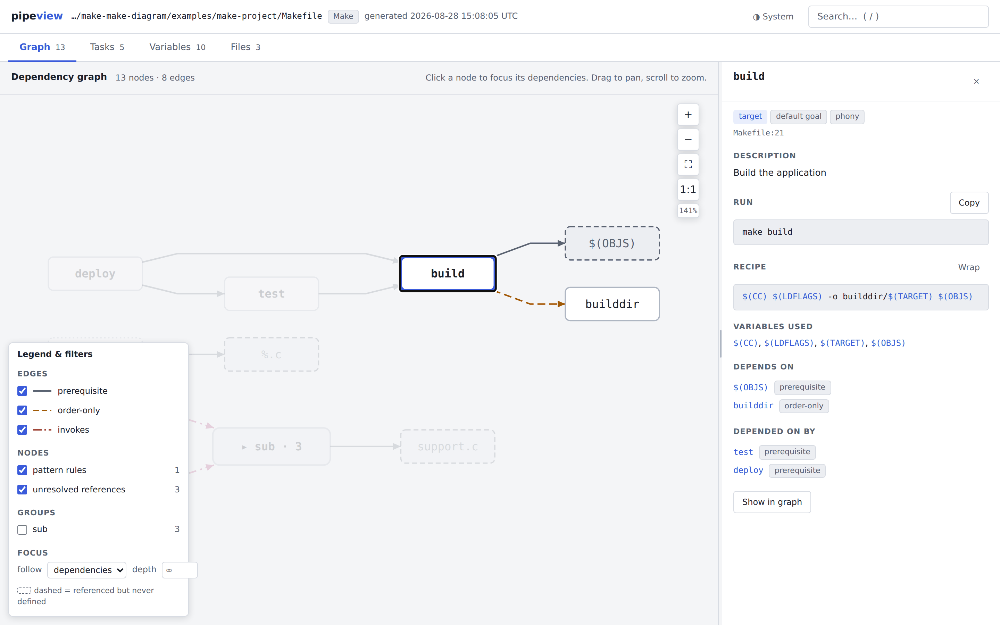
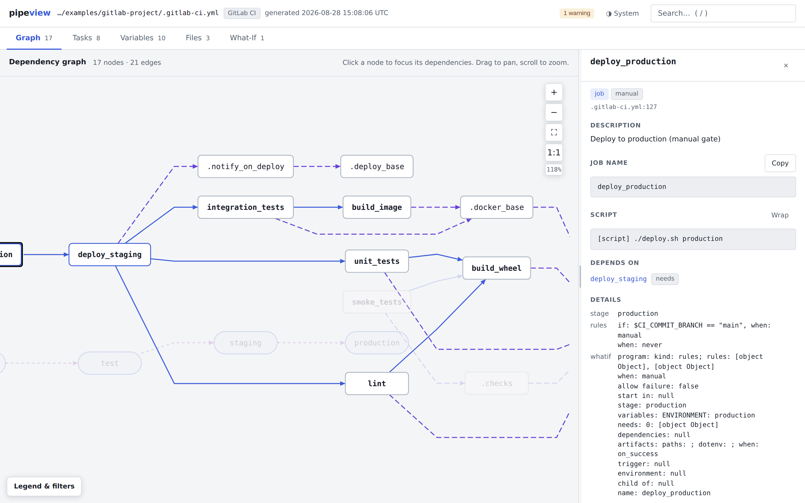
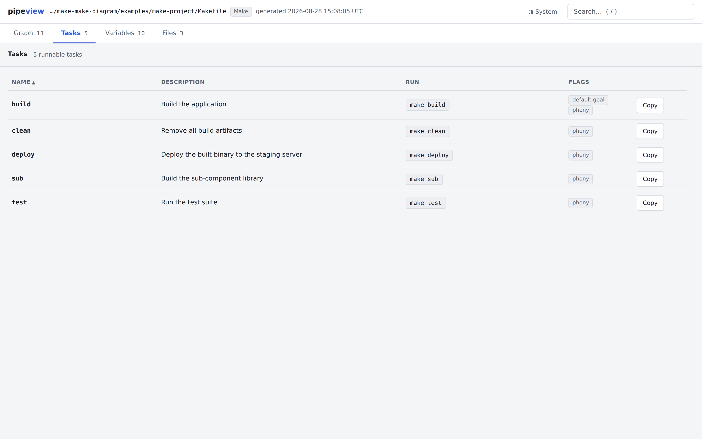
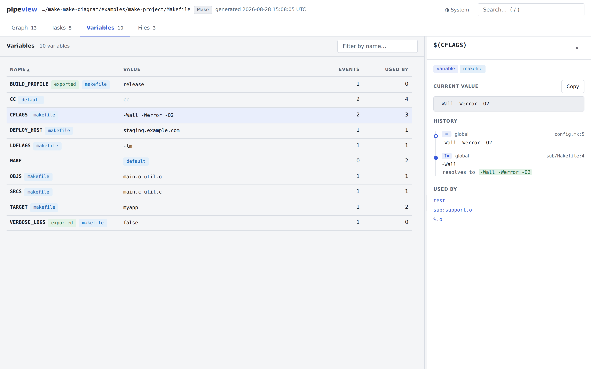
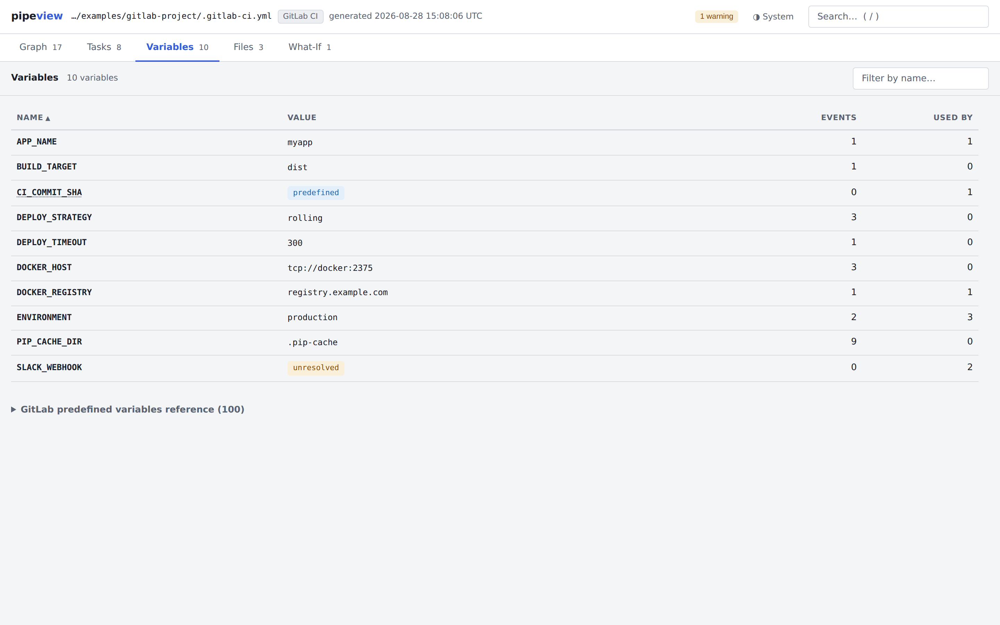
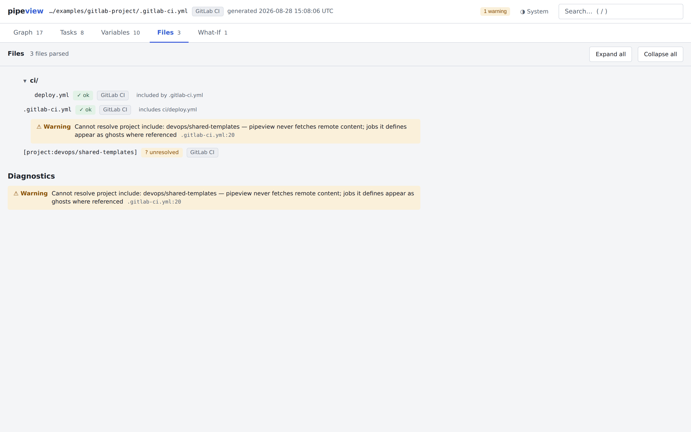
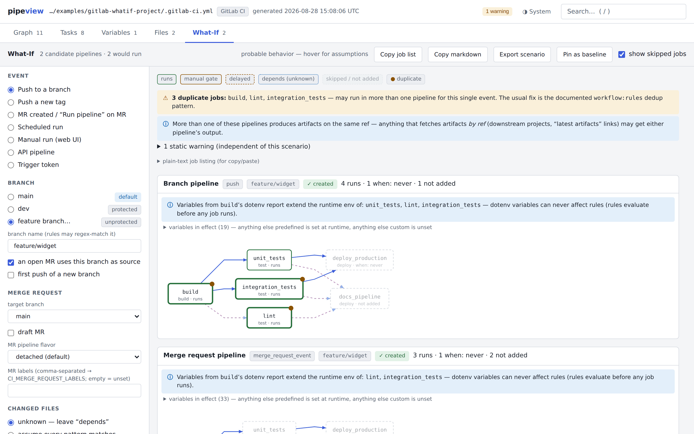
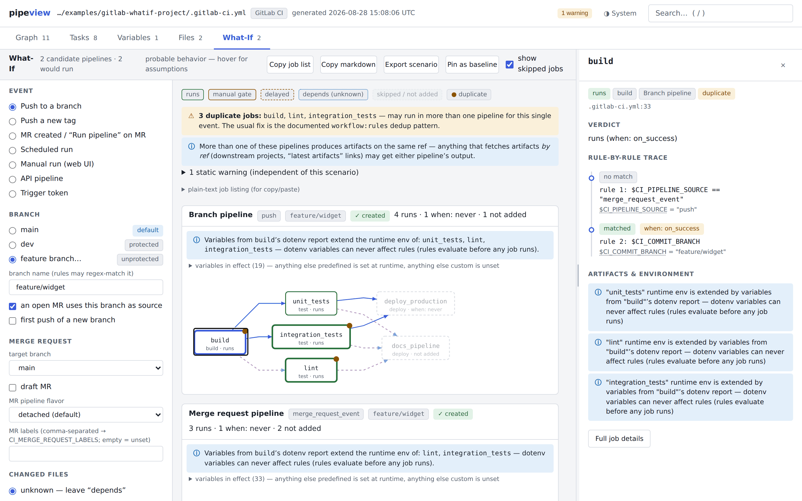
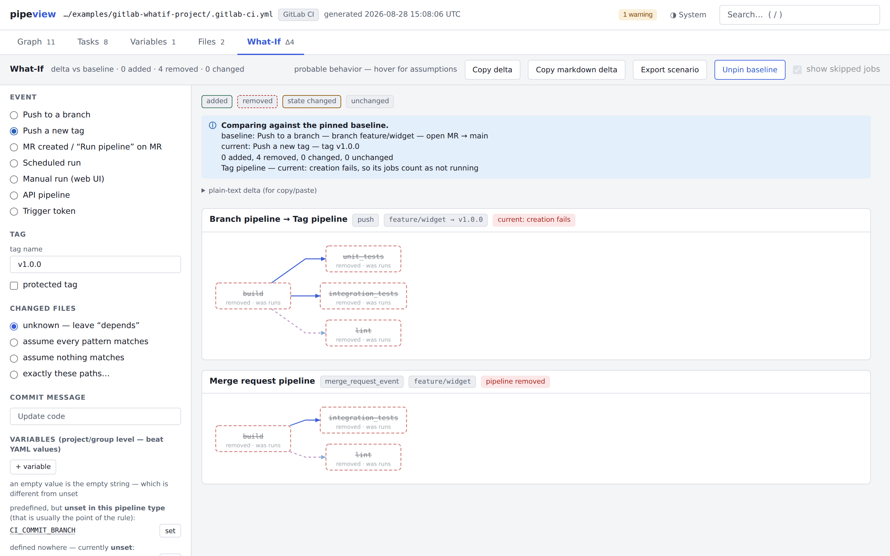
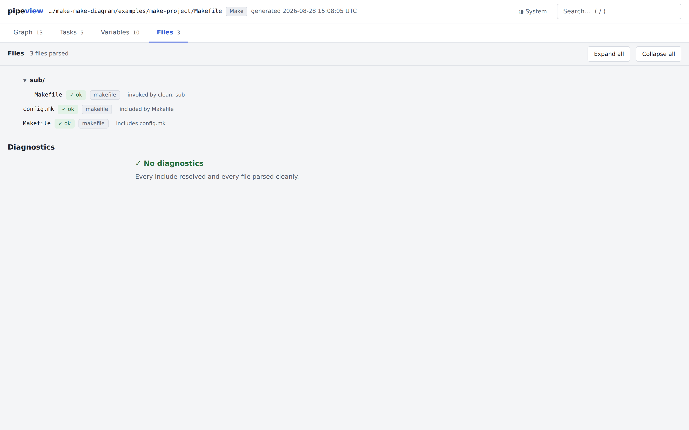

# pipeview user guide

pipeview reads build-pipeline definitions — GNU Makefiles and GitLab CI
YAML — and generates self-contained, fully offline, interactive HTML
reports. This guide tours every view of the report, then walks through two
complete workflows: mapping a recursive Make build, and chasing a GitLab
duplicate-pipeline problem through the What-If simulator.

All screenshots below come from the runnable projects in
[`examples/`](../examples/README.md), so you can regenerate every report
shown here and click around yourself. You need Python 3.10+ and PyYAML —
see [Installation](../README.md#installation) in the README for pipx and
air-gapped options:

```bash
git clone https://github.com/FooBarbarian-dev/make-make-diagram.git
cd make-make-diagram
pip install .

pipeview examples/make-project -o examples/out/make
pipeview examples/gitlab-project -o examples/out/gitlab
pipeview examples/gitlab-whatif-project -o examples/out/whatif
```

Each run writes a self-contained `*.report.html`. Open it like any local
file: `open <file>` on macOS, `xdg-open <file>` on Linux, `start <file>` on
Windows — or drag the file onto a browser window.

**Contents**

- [Generating a report](#generating-a-report)
- [A tour of the report](#a-tour-of-the-report)
  - [Graph](#graph)
  - [Tasks](#tasks)
  - [Variables](#variables)
  - [Files](#files)
  - [What-If (GitLab CI)](#what-if-gitlab-ci)
- [Worked example 1: mapping a Make build](#worked-example-1-mapping-a-make-build)
- [Worked example 2: chasing a duplicate-pipeline problem](#worked-example-2-chasing-a-duplicate-pipeline-problem)
- [From What-If to committed docs: trigger docs](#from-what-if-to-committed-docs-trigger-docs)
- [Working with a GitLab instance](#working-with-a-gitlab-instance)
- [When something looks off](#when-something-looks-off)
- [Other output formats](#other-output-formats)

## Generating a report

Point `pipeview` at a file or a directory:

```bash
pipeview Makefile                    # one Makefile
pipeview .gitlab-ci.yml -o report    # one GitLab CI file, output to report/
pipeview .                           # discover both in a directory
```

Given a directory, pipeview looks for a `Makefile` (or `makefile`, or
`GNUmakefile`) and a `.gitlab-ci.yml`, and generates one report per **root**
it finds — each top-level file that stands on its own as a pipeline
definition. Output lands in `./pipeview-out` unless you pass `-o`:

- `Makefile.report.html` / `gitlab-ci.report.html` — the interactive report
- `Makefile.model.json` / `gitlab-ci.model.json` — the normalized model
  behind it (see [Other output formats](#other-output-formats))

The report is a single HTML file with no external references. It works from
`file://`, over `scp`, attached to a ticket, on an air-gapped machine — no
server, no CDN, no network at any point.

For Makefiles, pipeview also runs `make -pqn` to capture resolved variable
values and the computed default goal. That executes Make's *read* phase,
which evaluates `:=` and `$(shell …)` expansions — if your Makefile has
side-effectful shell expansions, pass `--no-enrich`; the static parser alone
never executes anything.

Exit codes: `0` clean, `1` report generated but with warning/error
**diagnostics** — the problems found while parsing, all listed in the Files
view — or trigger-docs problems, `2` no report could be produced.
Info-level diagnostics leave the exit code at 0. `pipeview --version`
prints the installed version; to update a git install, `git pull` and
re-run `pip install .`.

## A tour of the report

The header shows the source file, its kind (Make / GitLab CI), the
generation time, and a diagnostics badge when the parse produced warnings or
errors — click the badge to jump to the diagnostics. The theme toggle cycles
System → Light → Dark, and the search box (shortcut `/`) finds any target,
job, variable, or file and jumps to it. Four tabs are always present —
**Graph**, **Tasks**, **Variables**, **Files** — and GitLab CI reports add
a fifth, **What-If**.

Clicking almost anything — a graph node, a task row, a variable, a file —
opens a detail panel on the right. The panel cross-links everything: a
variable's "used by" lists jump to the jobs that use it, a job's
dependencies jump to other jobs, and file:line references jump to the Files
view.

Everything is keyboard-reachable; the shortcuts worth memorizing:

| Keys | Where | What |
|------|-------|------|
| `/` or `Ctrl`/`Cmd`+`K` | anywhere | focus the search box |
| `↑` `↓` `Enter` `Esc` | search box | move through results, open one, close |
| `←` `→` `Home` `End` | tab bar (a tab focused) | switch views |
| `←` `→` `Home` `End` | panel splitter (focused) | resize the detail panel |

### Graph

The dependency DAG. Drag to pan, scroll to zoom, click a node to focus it —
the reachable subgraph stays highlighted while everything else fades, and
the detail panel opens with the node's description, recipe or script,
variables used, and its dependencies in both directions.


*A Make report focused on `build`: prerequisite edges, a dashed order-only
edge to `builddir`, and the recipe with clickable `$(VAR)` references in the
panel.*

The **Legend & filters** box (bottom left) doubles as the view options:

- **Edges** — toggle each edge kind: prerequisite, order-only, and invokes
  (recursive make) for Make; needs, stage order, extends, includes, and
  invokes (trigger jobs and child pipelines) for GitLab CI.
- **Nodes** — toggle stage lanes, templates, pattern rules, and unresolved
  references.
- **Groups** — GitLab child pipelines and recursive sub-makes fold into one
  expandable node each (with the trigger/recursion edge attached);
  check a group to expand it in place.
- **Focus** — choose the direction focus follows (dependencies, dependents,
  or both) and how many hops deep it reaches (empty = unlimited).

Nodes drawn dashed are **ghosts**: things referenced but never defined —
a prerequisite with no rule, a `needs:` on a job from an unresolvable
cross-project include. Every ghost also appears in the diagnostics list.


*A GitLab CI report: `needs:` edges (solid) cut across stage order,
`extends:` chains (dashed) lead to `.base`-style templates, and the panel
shows the selected job's rules and how they'll be evaluated (see
[What-If](#what-if-gitlab-ci) below).*

### Tasks

The "what can I run?" page: every runnable target or job with its
description, invocation command (with a copy button), and flags — default
goal, phony, manual, delayed, allow failure, parallel.


*Descriptions come from `##` docstrings above (or beside) the target or job
definition. Undocumented entries show a nudge to add one.*

```makefile
## Build the project
build: main.o
	gcc -o app main.o

deploy: ## Deploy to production
	./deploy.sh
```

### Variables

A searchable table of every variable with its final value, the number of
definition events, and how many recipes or scripts use it. Click a row for
the **event timeline**: every place the variable was defined, overridden,
appended, or shadowed, in order, with scope and file:line.


*`CFLAGS` was set with `=` in `config.mk`, then a sub-make's `?=` tried and
lost — the timeline shows both events and what the reference resolves to.*

Recipe and script text throughout the report renders `$(VAR)` (and GitLab
`$VAR`) references as links into this view.

In GitLab CI reports, predefined `CI_*`/`GITLAB_*` variables carry curated
documentation — what the variable is, an example value, and when GitLab
sets (or unsets) it — shown as tooltips wherever the name appears. Below
the table, a collapsible **GitLab predefined variables reference** documents
the whole catalog, with the names this configuration actually references
sorted first.


*Custom variables with values; predefined ones (like `CI_COMMIT_SHA`)
badged and documented; `SLACK_WEBHOOK` flagged as referenced but defined
nowhere — presumably a project-level setting.*

### Files

The include tree: which file included which, per-file parse status, and the
full diagnostics list. For Make this covers `include` directives and
`$(MAKE) -C` recursion; for GitLab CI it covers every `include:` kind.


*A local include resolved; a `project:` include didn't — offline, pipeview
never fetches remote content, so the include becomes a warning and its jobs
appear as ghost nodes where referenced.*

### What-If (GitLab CI and GitHub Actions)

A pipeline simulator, answering "what would actually run if…?" without
pushing anything. Pick an event in the left rail — push, tag push, MR,
schedule, manual (web), API, trigger token — then set the starting state:
branch or tag name, whether an open MR uses the branch, the MR's target /
draft state / labels / pipeline flavor (detached, merged results, or merge
train), changed files, the commit message, and simulated project-level
variables.

The results pane shows **every candidate pipeline** GitLab would consider
for that single event, side by side — branch pipeline and MR pipeline for
the same push, parent and child pipelines — each with a verdict per job:

| Verdict | Meaning |
|---------|---------|
| runs | a rule matched with `when: on_success` |
| manual gate | matched with `when: manual` |
| delayed | matched with `when: delayed` (start_in shown) |
| depends | the deciding fact is unknowable — never guessed |
| skipped / not added | no rule matched, or `when: never` |

`rules:if` expressions are compiled and evaluated for real; `rules:exists`
is checked against the actual repository; `rules:changes` uses your
changed-files setting, and with *unknown — leave "depends"* selected it
honestly reports *depends* instead of guessing. The simulated world assumes
`main` and `dev` exist and are protected; any other branch name is a
generic unprotected feature branch (hover *probable behavior* in the
toolbar for the assumptions).


*One push, two pipelines: jobs that would run in both are badged as
duplicates and summarized in the banner. Variables a job hands to later
jobs via `artifacts:reports:dotenv` are called out too, with a reminder
that they can never affect rules (rules evaluate before any job runs).*

Click any job for its **rule-by-rule trace**: each rule in order, which
matched, which didn't, and the exact variable values that decided it.

> **Why didn't my job run on this MR?** Pick **MR created / "Run
> pipeline" on MR**, set the target branch and any labels, list the MR's
> changed files, then click the job and read its trace: the first rule
> that matched with `when: never`, or no rule matching at all, is your
> answer — with the deciding variable values right there.


*`build` in the branch pipeline: rule 1 (`merge_request_event`) didn't
match because `CI_PIPELINE_SOURCE` is `"push"`; rule 2 matched on
`CI_COMMIT_BRANCH`.*

The toolbar buttons:

- **Copy job list** — the plain-text job listing (one section per candidate
  pipeline, jobs in stage order with verdicts), ready for an issue or chat.
  The same listing is visible in the collapsible *plain-text job listing*
  block.
- **Copy markdown** — the same as markdown tables, for issues, MRs, wikis.
- **Export scenario** — the current knobs as a trigger-docs YAML stanza
  (see [trigger docs](#from-what-if-to-committed-docs-trigger-docs)).
- **Pin as baseline** — freeze the current scenario, then flip any knob
  (the event preset included) to see the **delta**. While pinned, the
  button reads **Unpin baseline**, and the copy buttons become **Copy
  delta** / **Copy markdown delta**.


*Baseline: push to `feature/widget` with an open MR. Current: push tag
`v1.0.0`. Removed jobs are red-dashed, added jobs would be green, verdict
changes amber — and pipeline-level differences are named, here a tag
pipeline whose creation would fail outright.*

### GitHub Actions reports

Everything above applies to GitHub Actions repositories too — point
pipeview at a directory containing `.github/workflows/` (or a single
workflow file) and one report covers the whole workflow set:

```bash
pipeview examples/github-project -o out
open out/github-actions.report.html
```

The mapping mirrors GitLab's structure where the two systems align, and
is honest where they differ:

- **Graph** — each workflow is a collapsible cluster (primary workflows
  open, reusable `workflow_call`-only ones folded behind their caller's
  ▶ edge); `needs:` edges are the DAG — GitHub has no stages, so there
  are no stage lanes to draw. Cross-repository `uses:` calls are dashed
  ghosts offline; `pipeview github` resolves them into real nodes.
- **Variables** — `env:` at workflow/job/step scope with timelines,
  `workflow_dispatch`/`workflow_call` inputs as `inputs.*` entries,
  matrix axes, and curated docs for `GITHUB_*`/`RUNNER_*` variables and
  `github.*` context fields.
- **What-If** — candidates are *(workflow × fired event)*: one push to
  a branch with an open PR fires `push`, `pull_request` and
  `pull_request_target`, so a workflow subscribed to two of them runs
  twice — the duplicates banner names the branch-filter fix, the GitHub
  twin of GitLab's `workflow:rules` dedup pattern. Events cover push,
  tag push, pull request (with action), schedule, manual dispatch
  (declared inputs render as typed controls), and release. Verdicts are
  `runs` / `skipped` / *depends*; a job gated on an `environment:` with
  protection rules gets a note, never a guess — approval gates live in
  repository settings, not the workflow file. Secrets, `vars.*`, runner
  state and `hashFiles()` are *depends* until pinned.

## Worked example 1: mapping a Make build

The scenario: you've inherited a C project with a recursive build and you
want to know what you can run, what depends on what, and where `CFLAGS`
actually comes from.

```bash
pipeview examples/make-project -o examples/out/make
open examples/out/make/Makefile.report.html     # xdg-open on Linux
```

**1. Start at the Graph.** The DAG shows `deploy → test → build` at the
spine. `build` compiles `$(OBJS)` — dashed, because the object files are
produced by the `%.o: %.c` pattern rule, not by explicit rules — and has an
order-only edge to `builddir` (drawn differently: it must exist, but its
timestamp doesn't trigger rebuilds). A `sub · 3` group node marks the
`$(MAKE) -C sub` recursion; expand it from the legend's Groups section.

**2. Click `build`.** Focus mode highlights just its dependency cone, and
the panel shows the `##` description, the exact `make build` invocation,
the recipe with every `$(VAR)` clickable, and both dependency directions
(`test` and `deploy` depend on it).


*Everything outside `build`'s cone is dimmed; the legend shows the three
edge kinds in play and the collapsed `sub` group.*

**3. Check the Tasks tab.** Five documented phony targets with their
invocations — this is the page to send a new teammate.


*`build` carries the `default goal` chip — it's what bare `make` runs.*

**4. Trace `CFLAGS` in Variables.** The timeline shows `=` in `config.mk:5`
setting `-Wall -Werror -O2`, and a `?=` in `sub/Makefile:4` that loses to
it (`?=` only sets when unset — a classic silent surprise in recursive
builds). "Used by" links jump to `test`, the pattern rule, and
`sub:support.o`.


*The filled dot on the timeline marks the event that produced the final
value; "resolves to" shows what the reference expands to.*

**5. Files for the include story.** `Makefile → config.mk` plus the
recursion into `sub/Makefile` ("invoked by clean, sub"), each file marked
`✓ ok` — and, for this project, the designed empty state: "No diagnostics —
every include resolved and every file parsed cleanly."



## Worked example 2: chasing a duplicate-pipeline problem

The scenario: every push to a branch with an open MR starts *two* pipelines,
CI minutes are burning, and nobody is sure which jobs are doubled or why.
The example project has the classic causes: a job with no `rules:` at all,
a job whose final rule is a bare `when: on_success` catch-all, and a job
with explicit rules for both branch and MR pipelines.

```bash
pipeview examples/gitlab-whatif-project -o examples/out/whatif
open examples/out/whatif/gitlab-ci.report.html    # xdg-open on Linux
```

**1. Reproduce it in What-If.** Open the **What-If** tab. Pick **Push to a
branch**, choose **feature branch…** (leave the prefilled name,
`feature/widget`), and check **an open MR uses this branch as source**.
Two candidate pipelines render side by side — a branch pipeline and a
merge-request pipeline, both `✓ created` — and the banner names the three
jobs badged as duplicates: `build`, `lint`, `integration_tests`.


*Each duplicated job appears once per pipeline column, marked with a dot
badge; `deploy_production` stays dashed (`when: never`) in both.*

**2. Ask *why* per job.** Click `build` in the branch pipeline: its first
rule targets `merge_request_event` (doesn't match here), but rule 2 matches
`CI_COMMIT_BRANCH` — so it runs in the branch pipeline too. That trace, not
folklore, is your evidence for the fix.


*The trace panel names the rule that decided the verdict and the variable
values it saw — `$CI_PIPELINE_SOURCE = "push"` here.*

**3. Apply the standard fix and re-check.** Edit
`examples/gitlab-whatif-project/.gitlab-ci.yml` and uncomment the
`workflow:` block near the top (the documented dedup pattern). Re-run the
`pipeview` command above, reload the report in your browser, and re-select
the same knobs: the branch pipeline now collapses to *not created* while
an MR is open, and the duplicate badges disappear. (`git checkout
examples/` restores the example afterwards.)

**4. Compare states with a pinned baseline.** Curious what a release tag
would run instead? **Pin as baseline**, switch the event to **Push a new
tag** — the delta view shows exactly which jobs disappear, which appear,
and which change verdict, plus pipeline-level differences. Here the tag
pipeline's creation would fail outright: `unit_tests` (no rules, so it's in
tag pipelines) `needs: build`, whose rules keep it out of them — a real
pipeline-creation failure you'd otherwise discover by pushing the tag.


*The toolbar now reads **Unpin baseline** / **Copy delta**; the removed MR
pipeline and the failing tag pipeline are named side by side.*

**5. Share the finding.** **Copy markdown** pastes the job tables into the
MR discussion; **Export scenario** copies the knobs as YAML so the exact
scenario becomes a committed doc — next section.

## From What-If to committed docs: trigger docs

The What-If tab answers "what runs for this trigger?" interactively;
`--trigger-docs` answers it as **committed markdown** that reviewers can
read in GitLab's file viewer — plain sentences, job tables with a
deciding-rule "why" column, and mermaid diagrams.

The flow below runs against the bundled example so every command works
as pasted; in your own repository, replace
`examples/gitlab-whatif-project` with the path to your checkout (`.`).

```bash
pipeview scenarios init          # writes a commented pipeview-scenarios.yaml
# …or click "Export scenario" in the What-If tab and paste the stanza

pipeview scenarios check pipeview-scenarios.yaml       # validate
pipeview scenarios preview pipeview-scenarios.yaml \
    examples/gitlab-whatif-project                     # iterate on stdout

pipeview examples/gitlab-whatif-project \
    --trigger-docs pipeview-scenarios.yaml -o examples/out/whatif
```

Each GitLab CI root gets a folder beside its report — here
`examples/out/whatif/gitlab-ci.trigger-docs/` — with one `<id>.md` per
scenario plus a `pipeline-triggers.md` index. Copy it into the repo the
docs describe and commit:

```bash
mkdir -p docs/ci
cp -r examples/out/whatif/gitlab-ci.trigger-docs/. docs/ci/
```

The docs carry no timestamps, so regenerating with unchanged inputs is
byte-identical and `git diff` answers "did anything change?".

Close the loop with `verify` — it regenerates in memory, compares against
the committed folder (ignoring the generated-by marker comment pipeview
writes into each file, so a newer pipeview producing identical content is
not drift), and exits non-zero when the docs have gone stale:

```bash
pipeview scenarios verify pipeview-scenarios.yaml \
    examples/gitlab-whatif-project docs/ci
```

Run it as a scheduled CI job and doc freshness polices itself, with
pipeview still read-only — it needs no token and writes nothing:

```yaml
check-trigger-docs:
  image: python:3.12
  script:
    - pip install git+https://github.com/FooBarbarian-dev/make-make-diagram.git
    - pipeview scenarios verify pipeview-scenarios.yaml . docs/ci
  rules:
    - if: $CI_PIPELINE_SOURCE == "schedule"
```

The same honesty rules as the tab apply — the markdown and the What-If tab
run the same evaluation logic, kept in lockstep by a shared test suite, so
they cannot disagree: unknowables render as *depends* with the missing
fact named, and trigger jobs stop at the project boundary.

## Working with a GitLab instance (or GitHub)

Everything above is offline. The `pipeview gitlab` and `pipeview github`
subcommands — the only parts of pipeview that touch a network — fetch CI
configuration straight from the server, resolve cross-repository includes
and reusable workflows, and run the same offline pipeline on what they
fetched. The README's
[Fetching from GitLab](../README.md#fetching-from-gitlab-pipeview-gitlab)
and
[Fetching from GitHub](../README.md#fetching-from-github-pipeview-github)
sections cover the full flows; the two commands mirror each other
(`pipeview github auth` / `repos` / `report` / `track` / `sync`, the same
browser TUI, the same rollup). GitLab-specific highlights below:

```bash
pipeview gitlab auth --host https://gitlab.example.com   # once
pipeview gitlab                                          # browse (TUI)
pipeview gitlab report group/app --ref main              # one report
pipeview gitlab track group/app@release/2.0              # remember a ref
pipeview gitlab sync -o reports/                         # all tracked + rollup
```

With two or more projects tracked, `sync` also writes
`rollup.report.html`: a fleet view with one node per tracked project and
the `trigger:`/`needs:project`/`include:project` references between them
resolved into real cross-project links — the page for "which pipelines
feed which". Click a project there to drill into its job graph in place.

**Browser keys**: `↑`/`↓` (or `k`/`j`) move · `/` server-side search ·
`enter` open project, then generate for the selected ref · `o` open the
generated HTML · `t` track/untrack (in the project list: the default
branch; in the ref picker: the selected branch or tag — tracked entries
show `●` and sort first) · `?` all keys.

**Configuration** lives in `~/.config/pipeview/gitlab.json` (created
`0600`; honors `$XDG_CONFIG_HOME`, and `$PIPEVIEW_GITLAB_CONFIG` overrides
the full path). Tokens are looked up as `--token`, then
`$PIPEVIEW_GITLAB_TOKEN`, `$GITLAB_TOKEN`, `$GITLAB_PRIVATE_TOKEN`, then
the stored config. The host resolves from `--host`, then
`$PIPEVIEW_GITLAB_HOST` / `$GITLAB_HOST` / `$CI_SERVER_URL`, then the
stored default.

**When something looks wrong**, add `-v` (fetch steps and decisions) or
`-vv` (every HTTP request with timing), or `--log-file debug.log` for full
detail regardless. Diagnostics print per entry — including GitLab's own CI
Lint verdict — so a failing project tells you *what* failed.

## When something looks off

**The graph is too dense to read.** Click the node you care about — focus
mode dims everything outside its cone. Tighten it further from the
legend's **Focus** section (direction + a hop depth of 1–2), uncheck edge
kinds you don't need, and leave groups collapsed: a recursive sub-make or
child pipeline folds into a single node until you expand it.

**Exit code 1, but the report looks fine.** Something warned during
parsing. Click the yellow/red badge in the report header (or open the
Files view) to see every diagnostic with its file:line; the CLI printed a
summary to stderr too.

**Make variables show defaults, or values you know are wrong.** The
enrichment pass (`make -pqn`) may have been skipped — it is, silently with
an info diagnostic, when `make` isn't on PATH, errors, or takes longer
than 30 seconds. Check the Files view for the notice. The reverse case:
if your Makefile's `$(shell …)` expansions have side effects, run with
`--no-enrich` — the static parser alone never executes anything.

**A node is dashed and I don't know why.** Dashed means *ghost*: referenced
but never defined in the parsed files — a prerequisite with no rule, or a
job from an include pipeview can't fetch offline. Click it; the panel
names the reference that created it, and the matching diagnostic says
which include failed to resolve.

## Other output formats

`--format` takes a comma-separated list (default `html,json`):

| Format | File | Notes |
|--------|------|-------|
| `html` | `<name>.report.html` | the interactive report |
| `json` | `<name>.model.json` | the full normalized model — stable input for your own tooling |
| `svg`  | `<name>.graph.svg` | static dependency graph |
| `dot`  | `<name>.graph.dot` | Graphviz source |
| `mmd`  | `<name>.graph.mmd` | mermaid source (renders in GitLab/GitHub markdown) |

The JSON model is what the HTML report itself consumes — parsers emit it,
the renderer reads it, and nothing in the renderer knows whether the source
was Make, GitLab CI, or GitHub Actions.

---

*Screenshots in this guide were captured from the reports generated by the
bundled example projects, at 1440×900 in light theme.*
