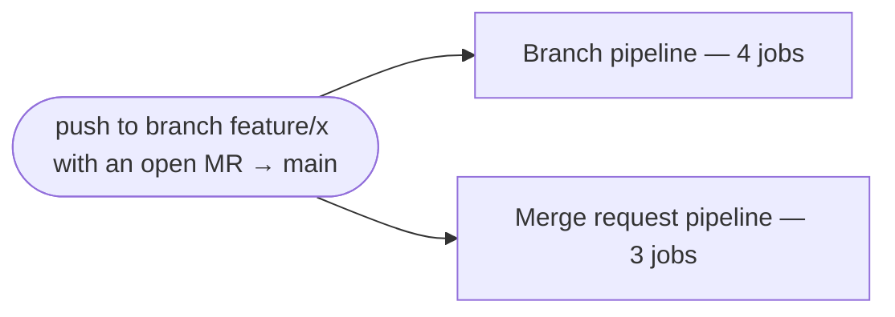
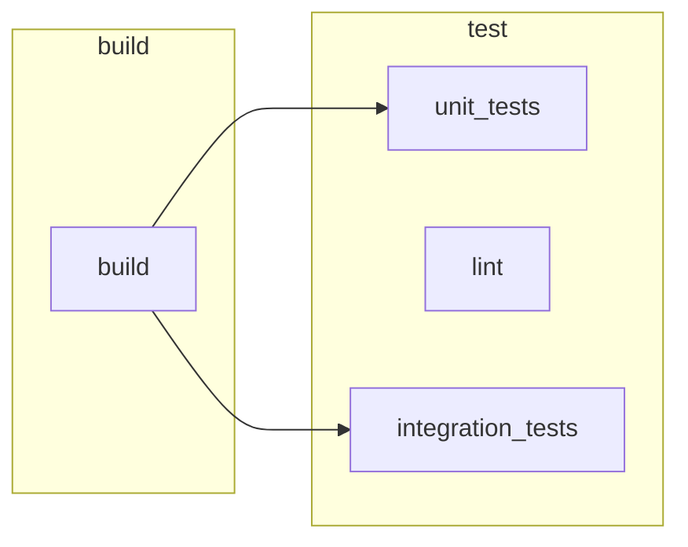
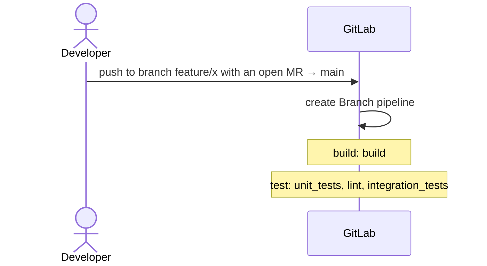
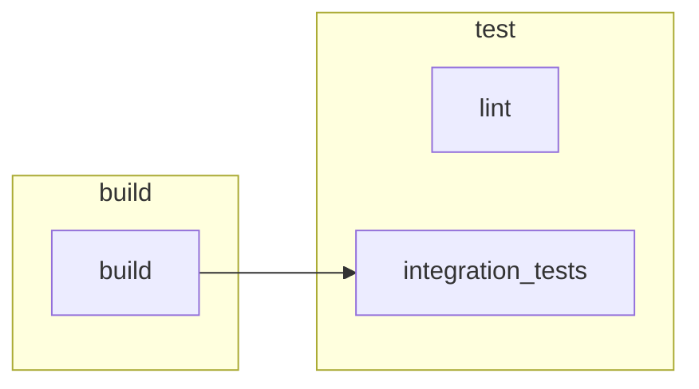
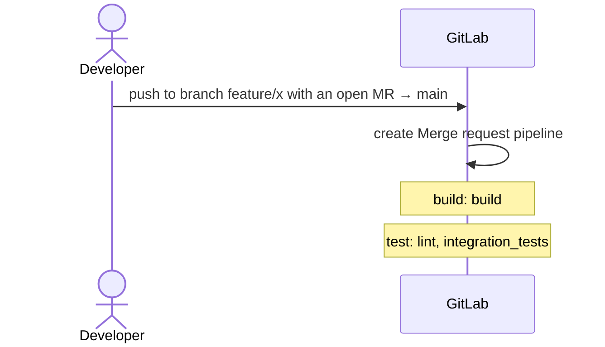

# Push to a feature branch with an open MR

<!-- pipeview-trigger-doc: project=group/app ref=main commit=abc1234def5678 scenario=push-feature-mr scenario-hash=08e991f4 pipeview=0.0.0-test -->
*Generated by pipeview from `group/app @ main` (abc1234def) — do not edit by hand.*

**Scenario:** push to branch `feature/x` with an open MR → `main` · changed files: not specified

## Outcome

- **Branch pipeline** (`feature/x`): 6 jobs — **4 run**; 2 not in this pipeline.
- **Merge request pipeline** (`feature/x → main`): 6 jobs — **3 run**; 3 not in this pipeline.

3 jobs would run in more than one of these pipelines for the same event: `build`, `lint`, `integration_tests`.

## Branch pipeline (`feature/x`)

*Hexagon = manual gate · ⏱ = delayed · dashed `?` = depends (unknown) · ▶ = spawns downstream. Jobs without an incoming arrow start when the previous stage finishes.*

| Job | Stage | Verdict | Why |
|---|---|---|---|
| `build` | build | runs | `$CI_COMMIT_BRANCH` |
| `unit_tests` | test | runs | — |
| `lint` | test | runs | — |
| `integration_tests` | test | runs | `$CI_COMMIT_BRANCH` |

Jobs not in this pipeline (2)

| Job | Stage | Verdict | Why not |
|---|---|---|---|
| `deploy_production` | deploy | skipped (when: never) | `when: never` |
| `docs_pipeline` | deploy | not added | no rule matched |

## Merge request pipeline (`feature/x → main`)

*Hexagon = manual gate · ⏱ = delayed · dashed `?` = depends (unknown) · ▶ = spawns downstream. Jobs without an incoming arrow start when the previous stage finishes.*

| Job | Stage | Verdict | Why |
|---|---|---|---|
| `build` | build | runs | `$CI_PIPELINE_SOURCE == "merge_request_event"` |
| `lint` | test | runs | — |
| `integration_tests` | test | runs | `$CI_PIPELINE_SOURCE == "merge_request_event"` |

Jobs not in this pipeline (3)

| Job | Stage | Verdict | Why not |
|---|---|---|---|
| `unit_tests` | test | not added | implicit default only: [branches, tags] (job has no rules/only/except) did not match |
| `deploy_production` | deploy | skipped (when: never) | `when: never` |
| `docs_pipeline` | deploy | not added | no rule matched |

