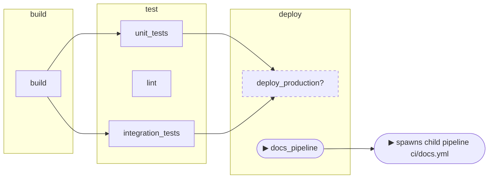

# Push to main

<!-- pipeview-trigger-doc: project=group/app ref=main commit=abc1234def5678 scenario=push-main scenario-hash=7da144b2 pipeview=0.0.0-test -->
*Generated by pipeview from `group/app @ main` (abc1234def) — do not edit by hand.*

What runs on every merge to main.

**Scenario:** push to branch `main` · changed files: not specified

## Outcome

- **Branch pipeline** (`main`): 6 jobs — **5 run**, 1 depends.

## Branch pipeline (`main`)

*Hexagon = manual gate · ⏱ = delayed · dashed `?` = depends (unknown) · ▶ = spawns downstream. Jobs without an incoming arrow start when the previous stage finishes.*

| Job | Stage | Verdict | Why |
|---|---|---|---|
| `build` | build | runs | `$CI_COMMIT_BRANCH` |
| `unit_tests` | test | runs | — |
| `lint` | test | runs | — |
| `integration_tests` | test | runs | `$CI_COMMIT_BRANCH` |
| `deploy_production` | deploy | *depends* | depends on `$CI_COMMIT_BRANCH == "main" AND changes: src/**/*, Dockerfile` — depends on which files changed — fill in the changed-files list |
| `docs_pipeline` | deploy | ▶ trigger | spawns child pipeline `ci/docs.yml` |
