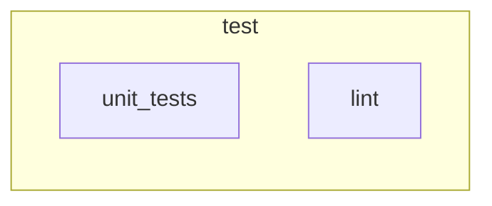

# Release tag

<!-- pipeview-trigger-doc: project=group/app ref=main commit=abc1234def5678 scenario=release-tag scenario-hash=5cc02254 pipeview=0.0.0-test -->
*Generated by pipeview from `group/app @ main` (abc1234def) — do not edit by hand.*

**Scenario:** push tag `v1.2.3` · changed files: not specified

## Outcome

- **Tag pipeline** (`v1.2.3`): 6 jobs — **2 run**; 4 not in this pipeline.

## Tag pipeline (`v1.2.3`)

> ⚠ **Pipeline creation fails** — GitLab refuses to create this pipeline:
> - "unit_tests" needs "build", but "build" is not in this pipeline (not-added) — GitLab would probably fail to create the pipeline

*Hexagon = manual gate · ⏱ = delayed · dashed `?` = depends (unknown) · ▶ = spawns downstream. Jobs without an incoming arrow start when the previous stage finishes.*

| Job | Stage | Verdict | Why |
|---|---|---|---|
| `unit_tests` | test | runs | — |
| `lint` | test | runs | — |

Jobs not in this pipeline (4)

| Job | Stage | Verdict | Why not |
|---|---|---|---|
| `build` | build | not added | no rule matched |
| `integration_tests` | test | not added | no rule matched |
| `deploy_production` | deploy | skipped (when: never) | `when: never` |
| `docs_pipeline` | deploy | not added | no rule matched |

